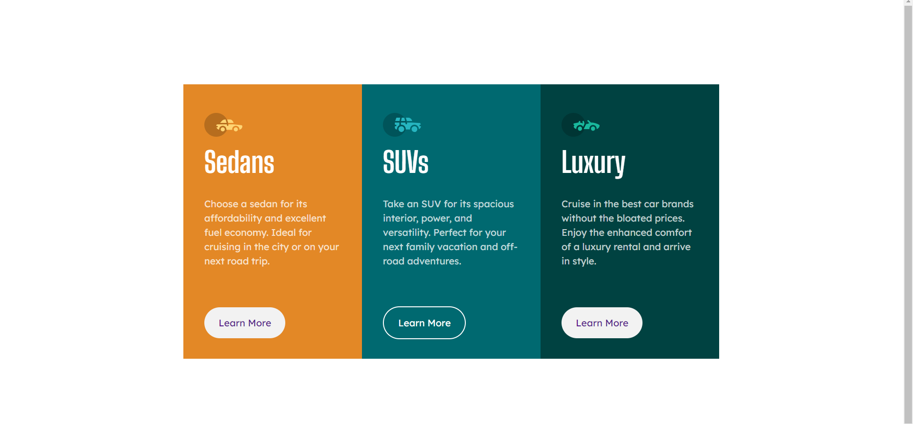
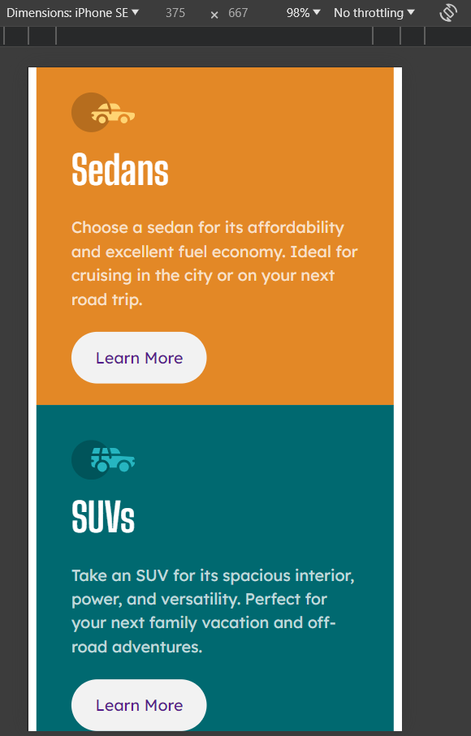

# Frontend Mentor - 3-column preview card component solution

This is a solution to the [3-column preview card component challenge on Frontend Mentor](https://www.frontendmentor.io/challenges/3column-preview-card-component-pH92eAR2-). Frontend Mentor challenges help you improve your coding skills by building realistic projects.

## Table of contents

- [Overview](#overview)
  - [The challenge](#the-challenge)
  - [Screenshot](#screenshot)
  - [Links](#links)
- [My process](#my-process)
  - [Built with](#built-with)
  - [What I learned](#what-i-learned)
  - [Continued development](#continued-development)
  - [Useful resources](#useful-resources)
- [Author](#author)

## Overview

### The challenge

Users should be able to:

- View the optimal layout depending on their device's screen size
- See hover states for interactive elements

### Screenshot




### Links

- Solution URL: ()
- Live Site URL: ()

### Built with

[](https://skillicons.dev)

### What I learned

Practiced my media query skills and responsiveness, also second time to actually put my Grid Skills into practice so it was really wonderful!

```
    .container {
    max-width: 375px;

    display: grid;
    grid-template-columns: 1fr;
}

.anchor:hover,
.anchor:focus {
    background-color: transparent;
    color: white;
    border: 2px solid white;
    cursor: pointer;
}
```

### Continued development

- I want to learn more about css by creating multi-page websites

### Useful resources

- (https://developer.mozilla.org/)
- (https://www.w3schools.com)

## Author

- Frontend Mentor - [@hassanmoaa](https://www.frontendmentor.io/profile/hassanmoaa)
